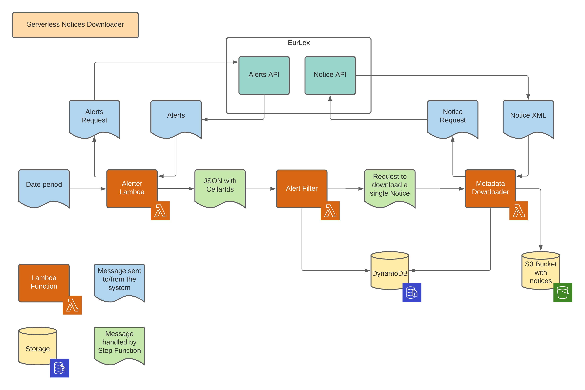

# AWS Serverless Architecture Model Example

## Top-level Overview

One the very top level this application allows downloading metadata legislation of the European Union from the [EurLex website](https://eur-lex.europa.eu/). EurLex website provides the Cellar API that allows sending REST requests and getting responses. For more information, please read the [Cellar API documentation](https://op.europa.eu/en/publication-detail/-/publication/50ecce27-857e-11e8-ac6a-01aa75ed71a1/language-en/format-PDF/source-73059305).



On the very top-level, the application consists of three lambda functions: 

* Ingest Alerter that is responsible for getting information about documents published within a given date period. 
* Inget Alert Filter that filters out documents that have already been downloaded. 
* Ingest Metadata Downloader which downloads Notice XML from the EurLex website and stores it to S3. 

All these functions are orchestrated by the Step Function and the state machine described in the `statemachine/eurlex_notice.asl.json` file. 

Let's have a deep dive into the code. 

## Ingest Alerter

Ingest Alerter is a simple lambda function written in JavaScript, all it's code is stored in the [app.js file](./functions/ingest-alerter/app.js). This function uses `axios` library to send REST requests asynchronously and parse the XML response. 

```javascript
exports.lambdaHandler = async (event, context) => {
    return new Promise((resolve, reject) => {
        // send a request to EurLex
        // get a response XML
        // parse data from the XML response
        // build a message to be sent back
        resolve(response);
    }
}
```

Input for this function is an `event` object that has two fields and stores information about time period which documents should be extracted for. 

Dependencies for the service are described in the [package.json](./functions/ingest-alerter/package.json) file.

**Input message format:**

```json
{
    "startDate": "2020-10-20",
    "endDate": "2020-10-21"
}
```

**Output message format:**

```json
{
    "items": [
        {
            "cellarId": "cellar1"
        },
        {
            "cellarId": "cellar2"
        }
    ]
}
```

## Ingest Alert Filter

Ingest Alert Filter is also a simple application written in Python that uses `robo3` library to deal with AWS services. The main purpose of this application is to check if a Notice for the given document has already been downloaded and should be skipped this time. Code of the application is mainly in the [app.py file](./functions/ingest-alert-filter/app.py).

```python
def lambda_handler(event, context):
    """
    Read cellarId from the event object
    Check if a correspondent record exists in the DynamoDB table
    Send the response back
    """
    event['exists'] = checkResult
    return event
```

This application uses DynamoDB table to store information about already loaded documents. Name of the table is provided using the `INGEST_DYNAMODB_TABLE_NAME` environment variable.

Dependencies for the service are described in the [requirements.txt](./functions/ingest-alert-filter/requirements.txt) file.

**Input message format:**

```json
{
    "cellarId": "cellarId"
}
```

**Output message format:**

```json
{
    "cellarId": "cellarId",
    "exists": true
}
```

## Ingest Metadata Downloader

This service should take incoming messages, extract cellarIds from them and next do three things: download a notice from the EurLex site, upload it to S3 bucket and create a record in the DynamoDB regarding downloaded document. 

Main code of the service is in the [app.py](./functions/ingest-metadata-downloader/app.py) file. For its works the service consumes two environment variables:

* `INGEST_DYNAMODB_TABLE_NAME` - name of the DynamoDB table which is used to store information about already downloaded documents.
* `INGEST_S3_BUCKET_NAME` - name of the S3 bucket used to store downloaded Notices. 

**Input message format:**

```json
{
    "cellarId": "cellarId",
    "exists": true
}
```

**Output message format:**

```json
{
    "cellarId": "cellarId",
    "exists": true,
    "downloaded": true
}
```

## Functions orchestration

Orchestration of lambda functions is performed by Step Functions and the state machine described in the [eurlex_notice.asl.json](./statemachine/eurlex_notice.asl.json) file.

In common, it implements the following flow:


If you take a look into the State Machine definition you'll see that it doesn't have hardcoded function names, instead it uses template params. 

Example:

```json
"IngestAlerter": {
    "Comment": "Get updates from EurLex for particular date",
    "Type": "Task",
    "Resource": "arn:aws:states:::lambda:invoke",
    "Parameters": {
        "FunctionName": "${IngestAlerterArn}",
        "Payload.$": "$"
    },
    "Next": "CheckNoticesLoaded"
}
```

As you may see, this code has `${IngestAlerterArn}` value, actual value is supplied by the `sam`. 

## Deployment

Deployment is performed by the Cloud Formation and template for it is also generated by the `sam` using the [template.yaml](./template.yaml) file. In common, this file is a Cloud Formation template which is additionally processed by the `sam` to simplify the deployment. 

# Build and deploy locally

In order to build and deploy the application locally you should have the `sam` installed. These links may be helpful:

* [What is SAM?](https://docs.aws.amazon.com/serverless-application-model/latest/developerguide/what-is-sam.html)
* [Installing SAM CLI](https://docs.aws.amazon.com/serverless-application-model/latest/developerguide/serverless-sam-cli-install.html)

When the `sam cli` is installed, use the following commands to build and deploy the aplication: 

```shell
$ sam build --use-container
$ sam deploy --guided
```

In order to redeploy and existing application or make a change to the existing application you anyway should rebuild and redeploy it: 

```shell
$ sam build --use-container
$ sam deploy
```

# Running the applicaion

To start the exectuion, execute a state machine with the message like this:

```json
{
    "startDate": "2020-10-20",
    "endDate": "2020-10-21"
}
```